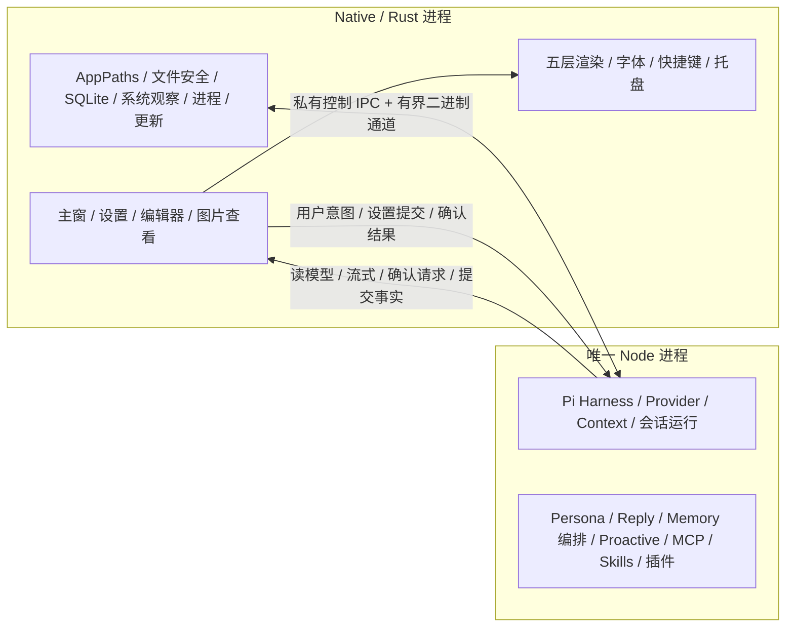

# 原生宿主轻量化执行契约（2026-10-04 基线）

**已归档，封存不再修改。** 本件是「无 WebView 原生宿主 + 唯一 Node Harness」迁移的目标架构、接口、工作包与验收清单。

- **当前剩余工作**：[未完成工作与已知缺口](../../plans/active/未完成工作与已知缺口.md) §10（唯一未完成总表）——**W10/W11 的验收条件、打包定案、L4 重接与资源口径已折入该节**，后续工作不依赖翻阅本件。
- **同批归档件**：[原生宿主迁移过程记录 2026-10-04 基线](原生宿主迁移过程记录-2026-10-04基线.md)（W0/W1 过程记录，含**仍具约束力的六条裁定**，已抽入总表 §10 正文）。

**归档时的状态**：W0–W9 的实现已落地（无 WebView/Tauri runtime、平台原生薄层、IPC 与 Node 监督器、Node 侧去 Tauri、窗口/灵动、图片/聊天/编辑器/设置、命令矩阵 128 条 = 109 冻结 + 19 扩展）。实现事实以源码与 `docs/current/` 为准；本件描述的是**当时的**目标契约，不代表当前行为。

初始只读探索基线为479aad7；编写期间其他工作已提交到90446e0（人格/名字/变量）及上述af2716f（通用设置手动检查更新），本页核对了变更范围，执行入口以交付快照为准。本轮自身只改计划/导航、清理自建实验目录。执行者开始每个工作包前重查 HEAD、工作树及相关消费者，不能把该快照当作永远不变的代码。禁止读取或修改 `docs/history/`。

## 1. 用户定稿范围

最新用户约束优先于本会话早先的轻量化提案。以下清单是已确认的功能边界；本轮只写执行方案，后续实施以用户交给执行agent的实际指令为准。本页不是提交/发布、删除真实 CONFIG 或用户运行时数据的授权。

| 领域 | 本次保留 | 本次删除 / 调整 |
|---|---|---|
| 宿主 | Windows/macOS；Native/Rust + 单个 Node TypeScript Harness；完整 `node:*`、CommonJS/npm、匹配平台/ABI 的原生扩展、Wasm | 全应用移除 WebView，不用隐藏 WebView 运行 Harness；不以 QuickJS 替代完整 Node 生态 |
| 灵动 | 最多五层、素材选择/显隐、位置、拖动、缩放、灵敏度、全局强度、图层锁定；现有位移/取景语义 | 删除景深、焦点区域/羽化和对应编辑分支；删除图层实时 brightness/contrast/saturate/drop-shadow 等复杂调色滤镜 |
| 素材 | 当前 Profile 的完整素材、自包含资源、切换/导入/导出/复制；现有原始像素量 | 本轮不缩小、重采样、裁剪或重编码角色素材，不合并五层成静态图来达标；像素量优化以后另做 |
| 编辑器 | 保留按需打开的图层编辑器；缩放、拖动、位置、灵敏度、保存和实时预览 | 不删除编辑器，不常驻隐藏的编辑窗口；只移除景深和复杂滤镜控件 |
| 窗口 | 透明、置顶、托盘、全局快捷键、一键呼出/收回、固定/光标位置、跨屏/DPI、呼出动画、焦点、音效；macOS Spaces/全屏辅助行为 | 收起动画结束后停止绘制；不能通过关闭 Harness 来停止主动陪伴 |
| 图片 | 选择/拖入、现有格式/数量/文件大小边界、模型看图、read 图片工具、截图及发图；原路径持久化和失效说明 | **聊天图片自动预览开关，默认关闭显示占位；开启按可见范围加载，点击仍可独立查看，关闭释放**；移走 Canvas/WebView 处理链；原图不改，派生预览/请求可轻度压缩 |
| 聊天 | 流式、分泡、正在输入、停止、队列/插话、会话、Plan/权限确认、恢复、复制/选择；富文本目标保留 | 不退化为纯文本版；图片占位不改变模型请求中的图像内容 |
| 字体 / UI | 系统字体枚举和选择、全局字号；现有设置入口、主题色、UI 位图和主要布局 | 不捆绑字体；UI 自定义渐进收敛，本轮不删除全部主题/位图/字体配置，不擅自拆掉现有一体主窗布局 |
| 领域能力 | Pi、Provider、Tool Calling、MCP、Skills、Prompt、Persona、Context、记忆、主动陪伴、观察/画像、插件、自动及设置页手动检查更新 | 不为省内存降低上下文/图片限制、取消治理、重放边界或来源资格，不重写 Pi loop |

### 1.1 当前源码与用户认知的差异

- 当前 `ChatPanel.vue` 的正文和流式正文主要是 `<span>` 文本插值，没有独立 Markdown/HTML renderer。用户明确要求富文本，故原生聊天包必须交付受控富文本呈现，不能据此删掉需求。
- 当前历史图像是 `chatImageUrl(path)` + ``。可见性懒加载不等于点击加载，不能拿现状当新需求已实现。
- 景深与灵动互斥。删景深主要减少景深模式的中间渲染面和复杂度，不保证灵动模式常驻内存按同等数额下降。
- 系统字体已经是全局设置；`fontdb` 枚举系统已安装字体，不存在本轮要删除的 Profile 字体包。

## 2. 最终架构与落位



### 2.1 固定架构与 UI 选型门

- **终态移除Tauri runtime、Wry和WebView**。允许平台原生薄层或轻量Rust UI框架，W0选择唯一生产UI，后续包依该结果实施；不要求自己从零造全部控件，也不保留三套生产前端。
- TypeScript 运行时：随包分发、锁定版本的标准 Node。最低须符合当前 Pi 的 Node `>=22.19.0`；版本由发布元数据唯一指定，W0 按当时维护版本与 Pi/插件兼容实证锁定，不依赖用户机器全局 Node。
- 保留现有 Pi 0.85.1 的原生 Harness/hooks/SessionRepo 接线。本次不夹带 Pi 升级。
- 文本/控件实现由W0选型结果冻结为一个 `NativeUi` 接口：窗口owner、文本输入/IME预编辑及候选位置、字体、富文本块、选择/剪贴板、链接、图片查看、控件事件。OS特有的快捷键/置顶/Spaces/托盘保留Rust平台适配，不与渲染框架绑成同一职责。
- 图像解码/必要缩放/编码集中 Rust 图片域；优先复用现有 `xcap::image` 对应的 image crate，显式打开需要的格式，不引入第二套 Node sharp/Canvas 图像系统。
- 发布打包首选锁版本的 `cargo-packager`（`.app/.dmg/NSIS`）；更新走 Native 的 `UpdatePort` + 独立安装 helper，见 §4.5。Tauri/Wry 不进入产品运行时。构建工具的复用不等于保留运行时 WebView。

#### UI 候选对照（选择成本和功能，不能只看空窗）

| 路线 | 适配与收益 | 成本 / 选型前必须验证 |
|---|---|---|
| 平台原生薄层，推荐比较基准 | AppKit/TextKit/Core Animation；Win32/RichEdit/DirectWrite/系统2D。系统字体/IME/窗口能力直接，渲染与缓存控制细 | 两平台控件和布局适配成本最高；富文本、主题/位图、编辑器需要实际实现，不自动等于最小总内存 |
| 精简Slint | 声明式布局/控件、多窗/文字样式/图像可以减少UI手写成本；Rust直接持有界面 | Markdown子集、系统字体、中文IME、GIF/WebP动画、自绘编辑器与底层窗口增强逐项验证；不根据软件空窗数字认定完整中文/缩放已支持，backend/renderer必须查锁定版本源码和实机 |
| 精简egui/eframe | 画布、工具控件、列表与拖动较易实现，可裁剪feature；编辑器适配便利 | 聊天富文本/系统字体/IME与多窗/缓存释放需补；立即模式不等于空闲必须持续绘制，必须证明停止重绘；驱动/font atlas/纹理计入内存 |

W0先只读筛选，再选择最有希望的路线与原生比较基准做**三个有界场景**：①聊天/富文本/系统字体/中文IME/历史图片占位与点开预览；②原尺寸五层+拖动缩放灵敏度+关编辑器释放；③快捷键/透明置顶/托盘/跨DPI/Spaces/全屏/多窗口生命周期。不能三个框架各写半套应用后长期并存。

选择须先满足全部功能gate，再比较同机同数据的进程树内存/峰值、空闲CPU/唤醒、启动和交互、包大小、双平台维护成本。60Hz交互下单帧CPU P95≤16.7ms是起始体验预算，不是已测结果。资源改善目标在W0采样后冻结；不为选某框架事后删IME/字体/编辑器功能。W0交接必须记录唯一选定路线、版本/feature集、控件/字体/动画格式实现和排除理由；若候选不满足gate，停止该候选而非直接扩大依赖。

#### 移除 Tauri 的可行性与收益

现有Tauri职责可映射：commands/events→HostBridge；窗口/global-shortcut/tray→Rust平台/轻量库；dialog/font/capture→原生API与既有域实现；updater/process→Native监督器/UpdatePort/helper；bundle/tauri-action→cargo-packager和重接CI。AppHandle/State等耦合是迁移成本，不代表业务核心必须重写。

收益是去掉Web页面/浏览器启动与窗口生命周期、Tauri命令/插件接线和前端IPC耦合，能按实际需要控制原生绘制及资源。**尚无Tauri Rust宿主自身的独立内存测量**，不能把WebView进程释放全部重复记成“移除Tauri的额外收益”。系统WebKit/WebView2通常不是应用自带资源，随包Node/npm/UI框架也会增加体积；包大小和启动收益必须分别测量。

对内存问题的明确结论：**只换掉Tauri框架、仍保留浏览器界面，并不能承诺明显变小；彻底去WebView再采用轻量绘制预计更有收益**。净占用变化约等于减少的浏览器/旧渲染资源，减去新增Node/新UI资源的成本。原始图片像素、纹理、请求Buffer不会随Tauri名字消失；当前只可预期整体架构降低占用，不能给Tauri本身标一个未经测量的MiB节省值。

### 2.2 目标目录（W0 后固定，不另建平行实现）

| 位置 | 职责 |
|---|---|
| `crates/native-host/` | Rust 原生宿主 crate（自旧 Tauri 壳迁入；**旧壳已删除**）；`src/{host,ipc,ui,render,images,commands,paths,memory,proactive,monitor,update,audio}` 按域落位 |
| `src/harness/main.ts` | 唯一 Node bootstrap，初始化 HostBridge、路径/配置/日志，再调用既有领域初始化 |
| `src/services/host/` | Node 的 HostBridge 实现、命令类型、事件订阅与数据流；公开入口 `index.ts` |
| `src/services/` 既有领域 | 继续持有 Harness/会话/人格/工具等业务；用公开 HostBridge 替换 Tauri/DOM 接口 |
| `resources/defaults/` | 原样移动随包默认 Card/Profile/Skill，角色位图字节/尺寸不变；默认文本按删除字段同步 |
| `packaging/` | Native 应用元数据、各 OS 打包/更新/Node 资源接线；版本与脚本校验同步 |
| `test/host/native/` | 真实 Native 宿主测试驱动和隔离启动，不是产品的第二个 runtime |
| `test/e2e/` | 保留 Scene/Contract 语义和 caseId，用 Native 真实宿主替换旧 Tauri 窗口 |

整个迁移是一个交付主题。局部包可以先通过 crate/Node 的局部检查，集成完成前不宣称主产品已切换或可发布。不要添加 `TauriCompat`、全局伪造 `window.__TAURI_INTERNALS__`、旧新双写、前缀数据根、两套 Profile 读取器或生产运行时开关。交付时旧 UI/宿主主路径必须删除。

## 3. 状态与持久化所有权

| 真相源 / 所有者 | 迁移规则 |
|---|---|
| Rust `AppPaths` | 继续决定 dev/release 数据根和允许根；Node 不用 cwd、`NODE_ENV` 或用户目录自行推算业务路径 |
| CONFIG、Card/Profile 文件 | 文件仍为真相源；Node 经现有类型化 getter 消费；原生 UI 持不可变显示快照/临时草稿，不另存设置 |
| Pi SessionRepo / JSONL | TS 继续事务编排、entryId/seq/lane/inbox/恢复；Rust 提供受控文件执行；不另造 Rust transcript store |
| Rust SQLite | Memory/proactive 治理、revision、租约、精确回执继续用既有库/连接；不建 Node SQLite 副本 |
| Node 运行态 | Harness 槽、Card/变量、Context、Planner、Reply/humanizer、MCP/Skill 编排；多会话/子代理不各开一个 Node |
| Rust 界面态 | 窗口/原生控件/渲染资源/图片预览；会话正文是 Node 读模型投影，不缓存第二份完整仓库 |
| Profile 资源 | Node 持元数据/领域选择，Rust 持当前 Profile 的解码/纹理；均绑定相同 id/revision，只有一个选择和保存入口 |

release继续使用现有应用标识 `com.v1rtual.deskpet` 与AppPaths平台数据根规则；手动安装Native不是把数据根移到安装目录。W0/W10只在隔离副本验证同路径会话/图片引用/CONFIG/Profile和种子标记。真实数据不读取以作测试fixture、不自动重建/迁移/恢复默认；已删除字段的处理见§7，需要真实配置/用户包清理时另获明确授权。

必须保持：用户 ingress 先落盘再投递；工具调用先落盘后执行、结果提交后再发下一次请求；取消不回滚已提交写入；未知外部副作用不重放；压缩只改变请求视图且摘要单事务；预算包含完整 schema/输出预留；回合冻结 Card/变量/配置/能力；RUNTIME_DATA 剥离验证后持久化；记忆 trusted-user 来源门槛/遗忘水位/dreaming 租约复核；主动结果只认提交条目和 SQLite 回执。完整说明见 `docs/current/`，本页不更改这些语义。

Node 侧纯 `ref/reactive/computed/watch` 可先保留其当前调度语义，经打包裁掉 DOM renderer。不要为几段状态代码顺手重写状态系统；若改成 `@vue/reactivity`，必须验证原 `watch` 的调度/清理时序，不能只替换 import 后认定等价。Vue 组件和 createApp 不进入最终产品 UI。

## 4. HostBridge 与进程契约

### 4.1 唯一桥接入口

`src/services/host/index.ts` 提供下面的公开形状；W0 从现有全部 `invoke`/Rust 注册导出完整类型矩阵，不依赖执行 agent 猜命令。

```ts
type RunScope = {
  appEpoch: string
  nodeEpoch: number
  sessionId?: string
  runGeneration?: number
  runId?: string
  turnId?: string
  toolCallId?: string
}
interface HostBridge {
  request<K extends keyof HostCommandMap>(
    method: K, args: HostCommandMap[K]["args"],
    options?: { signal?: AbortSignal; scope?: RunScope }
  ): Promise<HostCommandMap[K]["result"]>
  subscribe<K extends keyof HostEventMap>(
    event: K, listener: (payload: HostEventMap[K]) => void
  ): () => void
  readBlob(ref: HostBlobRef, options?: { signal?: AbortSignal }): Promise<Uint8Array>
  releaseBlob(ref: HostBlobRef): Promise<void>
}
```

- 命令名沿用现有有消费者的业务命令，例如 `file_read`、`session_read_text`、`capture_screenshot`、memory/proactive 命令；替换 transport，不建立一套重名兼容命令。
- envelope 含 `protocolVersion/requestId/kind/scope/payload`；响应保持结构化 AppError 的 code/message，禁止降为 String 错误。
- 事件含 producer epoch、单调 eventSeq、归属 scope。旧 Node、旧会话/代际、旧 Profile/预览 owner 的结果不得写新状态。
- 确认保留精确参数/策略/有效期/会话/代际绑定；关闭确认窗口、切换会话、取消、进程崩溃均有明确归宿。
- durable entry/tool/run/receipt 事件不可丢；纯流式显示增量可有界合并，但最终 UI 以提交读模型收敛。

### 4.2 传输与背压

- 使用 OS 私有端点：macOS Unix domain socket、Windows named pipe。Native 创建端点并拉起 Node；每次启动生成身份/随机握手值，只经受控启动信息传入，不写 CONFIG/日志。
- **IPC 不复用 stdout/stderr**。完整 npm/原生扩展可能自行打印，不能让它们破坏 RPC framing；两条标准输出只作日志采集。
- 控制通道与二进制数据通道分开，消息带长度。取消、shutdown、owner 失效使用控制通道优先队列，不排在图片字节队列后面。
- W0 的起始常量：控制帧上限 64 KiB、二进制块 64 KiB、每流 credit 256 KiB；这些是流控单位，**不是图片/文件输入上限**。常量在 Rust IPC 域定义，握手披露给 Node，不双存默认值。
- 控制队列有界；持久边界背压等待、不静默丢弃；显示增量合并须保留顺序和终态。阻塞/超时/对端断开可取消 pending I/O，GUI 主线程不同步等 socket/Node。
- 大内容以短期 `HostBlobRef{id,bytes,mimeType?,scope}` + 二进制通道传输。Rust 注册表校验 owner、长度、生命周期；关闭/取消/断开归还句柄。不得把任意路径当 blob 授权。
- 64 KiB 控制帧不是用户文本或工具结果限制。超长字符串/命令字段由 HostBridge 编码为 blob，再向业务消费者物化完整原值；命令的应用层结果类型不因 transport 改造缩水。
- 不复制用户原图到新持久目录，不把大图编码进控制 JSON 或 `number[]`。必要图片数据进入 Provider 的 Node Buffer/base64 后仍会占内存；不能宣称 IPC 改造实现了全链零拷贝。

### 4.3 生命周期

1. Rust 建路径/日志/SQLite/原生事件循环；创建产品窗口和托盘能力；监督器拉起随包 Node。
2. 校验应用版本、协议版本、Node runtime/ABI；握手后按当前 `initApp` 顺序初始化人格、会话、工具、主动/观察调度，不随窗口重开再初始化。
3. Node 忙碌/无响应时快捷键与窗口显隐仍由 Rust 本地完成。系统错误保持中性，不以 Card 台词遮盖宿主故障。
4. 关闭主窗口只收起；关闭设置/编辑器/预览销毁该 UI owner，不能关闭 Harness 或取消其他会话任务。
5. 退出/重启先封新 admission、取消运行、等已准入写队列/usage/audit flush、回收 MCP/Bash/插件由宿主管理的子进程，再停 Node 和退出 Native。超时如实记中断，不能伪报 flush 成功。
6. Node 崩溃后 Native 保留托盘/错误界面；重新启动必须换 nodeEpoch、使旧权限/owner 失效、按 JSONL 恢复待处置状态。**不自动驱动有未知副作用的操作**。

所有被应用拉起的进程纳入清理和资源统计；Windows 用可核对的进程生命周期管理，macOS 同样不得遗留孤儿。插件自行启动/脱离的进程也应标记资源归属或报告未知，不能只统计主程序。

随包Node采用包含 `node`、npm/npx CLI及必要运行库的完整发行闭包，不只复制node.exe。Rust进程管理域统一把MCP命令 `node/npm/npx` 解析到随包可执行文件/CLI脚本，并给子进程正确PATH；不得假设干净机器有全局npm。依赖安装/包缓存路径由AppPaths派生，不能写只读安装资源；此轮不新增插件市场或自动安装UI，只保证标准模块解析/CLI及用户显式配置的MCP运行能力。

core bundle外置动态包和`.node`，原生扩展须匹配OS/架构/Node ABI或N-API。更新Node时检查fixture插件加载；不能自动保证任意源码扩展无需用户编译工具，也不能混用旧ABI二进制。失败明确提示，保留原包/用户数据，不偷偷重建真实插件目录。

### 4.4 Node 插件信任边界

完整 `node:*`/原生扩展意味着插件是本机受信任代码，能自行访问 OS。Rust 仍最终裁决经内置 ExecutionEnv/宿主接口发起的模型工具操作；现有 PermissionKernel 的语义门禁和 Rust 硬基线均保留。它们不构成约束任意 npm/native addon 的通用沙箱。不要为声称“权限全部在 Rust”悄悄删除 Node 能力或另造无法兑现的隔离层。

### 4.5 打包与更新定案

- `cargo-packager` 官方支持现有可执行文件和资源生成 macOS `.app/.dmg`、Windows NSIS，适合打包 Native launcher + Node + JS + 资源；W10 pin 实际版本并验包树，不引入运行时 WebView。
- 当前 `cargo-packager-updater` 主源的安装实现没有提供可直接依赖的 macOS `.app` 整包替换路径；**不能把名字相近的 updater 当成已闭合的双平台安装器**。W10 用可注入 Native `UpdatePort`，下载/校验/staging 在主宿主，关闭整套进程后由 helper 替换/重启。
- 最终 Native 更新源为 `update.json`，单一 schemaVersion；签名 release envelope 覆盖 version、platform/arch、artifact SHA256/size、URL及应用标识，制品签名/哈希另验证。不是只验下载文件却信任任意manifest版本；低版本/错误平台/不完整组件集拒绝安装。
- `.app` 整目录包含对应 Node 和 JS；Windows安装器同样更新完整版本集合。安装前回收 Node/插件/MCP，helper记录可恢复的安装状态，失败回到上一完整版本，不把 Native、新Node和旧JS混装。数据根不在替换目录内。
- Native 版本之间保留应用内确认→下载→安装→重启。**旧Tauri到Native的首次跨宿主升级采用手动安装**；按开发期规则不新增桥接版本/兼容feed/旧manifest读取或双写。发布说明必须明确此边界，发布授权仍由用户决定；本轮不触碰既有Release资产。
- 当前 Apple/Windows代码签名未交付的状态不能因换打包器自动变为已签名；首次Native包和更新helper的签名/公证状态必须如实记录，签名密钥不进入日志或方案正文。

## 5. 图片：路径、预览、请求三条生命周期

### 5.1 为什么路径仍可能带来大内存

持久字段 `deskpetImagePaths` 本身很小。当前 `ChatPanel.vue` 显示路径时 WebView 会加载并解码；`loadRequestImage` 还会经 `file_read_binary -> number[] -> Uint8Array -> ImageBitmap/Canvas -> Blob -> base64` 构造临时请求。

解码像素通常按约 `宽×高×4` 字节计算：1920×1080 的一份 RGBA 约 7.9 MiB；编码文件大小不等于解码/纹理大小。Base64 长度通常约编码字节的 4/3，阶段间还可能有副本。压缩编码字节主要改善 I/O/请求缓冲，**同像素量解码后的内存不会随 JPEG 文件大小同比下降**。

### 5.2 持久和能力不变

- 用户/助手图片附件继续只持久化原文件路径及既有消息元数据；不持久化聊天预览、缩略图或请求编码，不覆盖原图。
- 保持当前格式 PNG/JPEG/GIF/WebP/BMP、每消息最多 4 张、每图 15 MiB 的准入；值仍由 `src/services/images/limits.json` 单源提供。不能为了内存改成单图或仅 PNG。
- **动画GIF/WebP的逐帧播放不接入产品（2026-10-04用户指令，理由：内存）**：GIF/WebP **仍属准入格式**（`src/services/images/limits.json` 的五种不变），可收、可显示，但**只显示首帧**，不做帧推进、循环播放或动画 worker。查看器与内联预览统一到同一口径。
  - 本条**取代**原文的「W0/W7须验证锁定codec对动画GIF/WebP的帧解码/透明/播放与释放……补充所需codec实现而非移除格式/动画能力」——该句随用户新指令作废，**仅「不播放动画」这一点变更，格式准入与静态解码能力不变**。
  - 角色侧另有独立事实：**表情/精灵动画早在 2026-09-20 就已移除**（归档见 `docs/history/implementation/表情动画音效移除-2026-09-20基线.md`），当前代码零痕迹，与本条无关；§6.1 的「五层」是图层位移/缩放，也不是帧动画。
- 保留现有 read 图片工具、截图/静默了解/发图、模型不支持图片的说明、文件失效说明。工具结果的 Pi 条目格式不借本轮迁移改写。
- `readImageProcessor` 的现有长边 1568、BMP→PNG、真实 MIME、失败回退原图语义继续保留；截图长边 1280/编码上限 8 MiB/最近 200 张继续按现有域常量和流程执行。
- 仅派生预览/已需重编码的请求图可以做轻度压缩；JPEG 质量 90 作为起始候选，文字/透明/像素素材优先无损。小图原样原则不改变；原图/角色图层资产不改。编码结果与 MIME 必须一致。

### 5.3 聊天图片自动预览开关与占位协议

设置项为“聊天图片自动预览”，唯一字段 `appearance.chatImagePreview: boolean`，默认 `false`。它只控制聊天历史的内联图像显示，不关闭模型看图、图片选择/发送、截图/read能力，不改变JSONL里的原路径。

| 开关 | 历史呈现 / 资源策略 |
|---|---|
| 关闭（默认） | 历史、滚动、切会话及初次加载仅显示图片占位（序号/文件名/可用状态）；**不读取图片字节、不解码、不生成缩略图**。点击占位仍可以打开独立查看器 |
| 开启 | 只为当前可见消息按需加载内联预览，不一次解码全部历史；离开视口、切会话、收起或关闭聊天视图时取消并释放内联资源，仍可点击进入独立查看器 |

开关变化立即生效并持久化；关闭时取消正在进行的内联加载、释放内联图片/纹理，晚到结果按viewGeneration丢弃。用户显式打开的查看器有自己的owner/关闭动作，不依赖自动预览开关。可用性不强制逐条预读，点击时明确返回失效原因。

```ts
type PreviewOwner = {
  windowId: string; viewGeneration: number
  sessionId: string; entryId: string; imageIndex: number
}
// Native UI 内部接口；不要求 Node 持有解码图。
openPreview(owner: PreviewOwner, source: ValidatedImagePath): Promise<PreviewHandle>
closePreview(owner: PreviewOwner): void
```

- 点击后按 Rust 路径规则复核原文件，异步加载到一个图片查看 owner；预览与模型请求不共享永久缓存。
- 同时只保留当前图片的预览资源；支持原有格式所需的呈现，包括动画格式在 UI 基线中已具备的能力。动画逐帧解码/释放，不能把整段帧序列永久缓存来换流畅。
- 关闭查看器、切图、切会话、收起主窗口、退出或文件失效时取消解码/动画并释放 CPU 图、GPU 纹理、编码 Buffer、打开文件。晚到解码结果按 owner/viewGeneration 丢弃且释放。
- 图片待发送区属于用户主动选择后的状态，可以按需显示预览，但发送/撤选/切会话后释放；不据此预热历史图片。
- 超大图资源失败给明确系统诊断，不静默删除路径或降低图片数量/格式。任何新增准入限制须另外决策，不能把 decoder 保护阈值伪装成原有功能等价。

### 5.4 模型请求协议

Node 的 `hydrateImageMessages/loadRequestImage` 仍只构造临时 Provider 视图，不改 JSONL。Rust 提供 `prepare_request_image`：保留原路径校验、现有缩放/格式规则，返回编码字节 blob、真实 MIME 和 hints。Node 经二进制通道获得 Buffer，使用标准编码形成 Pi `ImageContent`；不用 JS 手工逐字符 base64、Canvas 或数字数组。

Pi read 工具的 `ReadImageProcessor` 接口仍保留；它收到的字节送同一 Rust 图片处理实现，避免请求附件/read/screenshot各建缩放器。模型请求只使用当前预算投影需要的图，缓存限一次请求、同路径去重，完成/失败/取消后释放所有应用自有引用。SDK/Pi 必需的消息引用按现有 SessionRepo 生命周期处理，不声称清一个 Map 就释放了全部图片内存。

验收同时证明：开关关闭时仅浏览历史零图片解码；开启只加载可见内联图，关闭/离开视口释放且晚到结果不恢复；开关保存重开保持；点击确实读原路径、关查看器释放；模型不点击预览也仍收到图像 part；反复模型请求不依赖 UI 缓存；路径失效保持占位/中性说明；截图仍先保存再挂助手条目，取消不产生半条可见图片消息。

## 6. 灵动、隐藏、富文本、字体与编辑器

### 6.1 灵动数值与渲染

以 `useParallax.ts` 当前数学为基线：光标相对窗口中心归一化并夹到 [-1,1]；`s=sensitivity×intensity`；最大位移按 `s×40×窗口宽/配置弹窗宽`；深度夹 `s/1.6` 到 [0,1]；深度缩放从 1.02 线性到 0.98，再乘用户 scale；位置偏移仍用百分比，顺序与 z 层一致。W0 冻结 golden 数据，Rust renderer 与编辑器共用一个零 UI 依赖的几何实现。

- 保留 `enabled/image/sensitivity/scale/offsetX/offsetY/locked`；删除 `shadow/brightness/contrast/saturate` 和景深字段。不为删除效果写旧参数兼容分支。
- Profile 内素材原始哈希、宽高、alpha 不改变；本轮也不以缩小运行期角色纹理解码尺寸作为达标办法。
- 仅加载当前 Profile/启用图层；同一素材内容尽量复用纹理，上传后释放无消费者的 CPU 副本，不为每帧重新解码/上传。
- 角色舞台和编辑器预览共用资源/几何语义；编辑器不同 view 不自动复制完整 Profile 或大图，只在确有平台需求时记录副本成本。
- 删除滤镜后的光影变化是已授权差异；取景、位置、缩放、层次/灵动效果和主要 UI 表现仍须截图/动作对照。

### 6.2 快捷键与停止绘制

快捷键由 Rust 在原生事件循环注册处理，复用现有组合配置、重复按键护栏、固定/光标位置和跨屏坐标逻辑；无需等 Node 返回。保留现有呼出/收回的动画时长、曲线、光标/固定点 transform origin、输入焦点和提示音。

`visible -> retracting -> hidden -> revealing -> visible` 是单一窗口状态机：收起时先完整播放缩放淡出，动画终点停止帧回调/重绘/鼠标绘制更新；hidden 只保存最新逻辑状态，不产生循环帧。显示后应用最新 Profile/窗口尺寸，再按原行为播放呼出。窗口/系统事件不应为隐藏界面触发不断重绘。

保留当前 Profile 的必要纹理以避免呼出冷启动；释放临时绘制面与预览缓存。停止绘制主要降低 CPU/唤醒，不等于解码纹理内存归零。Node 的主动陪伴、预算、事项和记忆任务按原协议继续工作。

### 6.3 聊天与富文本

- 当前一体主窗布局、会话入口和交互先保留。后续小角色窗/聊天浮层等布局调整不是本轮内存达标捷径。
- 基础受控富文本目标：段落/换行、粗体/斜体、列表、引用、行内代码、代码块、链接、表格（原生块/网格布局）；原文选择/复制、长代码块滚动和流式半截标记可读。W0 做固定输入和截图，避免无限扩成 HTML/CSS 页面引擎。
- 原生 renderer 使用安全 text-span/块协议，不执行 HTML/脚本，不为 Markdown 图片语法自动访问网络；图片由附件占位协议控制。链接仅用户点击后经宿主打开，禁自动触发。
- 通过W0冻结的NativeUi文本/布局接口实现；若选择原生薄层，分别落AppKit attributed text和明确的Windows文本控件/DirectWrite方案；若选择框架，按已验语法/IME/字体能力实现，不让各包自行再选控件。节点不保存第二份富文本 Store；正文和 humanizer parts 仍来自既有读模型。
- 保留分泡揭示、typing Card 文案、工具/think/plan/retry状态、停止/恢复、队列 intent、权限确认与 Plan 步骤决策。流式显示不能绕过 RUNTIME_DATA 剥离规则。
- UI 可按视口分页/回收排版缓存；这只裁剪显示资源，不截断会话正文、不改 ContextKernel 或 SessionRepo 的完整读取语义。

### 6.4 字体、设置、编辑器

继续由 `appearance.font` 全局裁定 family/size，`list_system_fonts` 枚举系统字体。Native 在各窗口应用同一快照，缺失字体使用系统 fallback；字体不随 Profile、不复制字体文件。编辑器/设置打开时才创建控件、枚举/读取需要的元数据，关闭销毁 UI 资源而不关 Node。

编辑器至少保留：五层选择/显隐/锁定、换素材、拖动、位置、缩放、灵敏度、强度、主窗/预览一致、保存与关闭持久化。主窗/编辑器的高频拖动预览本地处理；保存仍走现有 Profile 唯一写入路径和原子写盘，不新增 localStorage 或编辑状态持久副本。

主题色、UI 位图、窗口圆角/主要布局先保留并记录平台差异；不得借“UI慢慢调”一次性删除配置入口。新原生控件须保持标签、键盘导航、焦点、中文 IME 和系统字体，不能只靠图片按钮替代操作语义。

## 7. 配置 / Profile / 默认资源同步清单

字段删除不能只删 UI；必须逐项同步：

1. `appearance.effectMode` 定型为 `off | parallax`，删除 `dof` 选项；off 的静态显示与已有产品语义对齐。保留字体、强度、快捷键、弹窗尺寸/位置、聊天宽度等字段。
   任意非法枚举（包含旧`dof`）按同一CONFIG校验失败处理：中性诊断并提供正常设置/手动修正入口；不写`dof→parallax/off`特殊兼容映射，不静默改真实文件。用户通过设置明确保存时才写最终有效值；仅启动/读配置不得擅自写盘。
2. 删除 Profile `theme.depthOfField`、`ProfileDepthOfField/ProfileDofRegion`、`materials/dof` 种子中的无消费者资源；删除图层 `shadow/brightness/contrast/saturate` 类型/默认/保存/控件。
3. `CONFIG.yaml -> CONFIG-DEV.yaml.example -> config.ts getter/types -> AppearanceTab/SettingsPanel目标原生控件 -> 保存/刷新消费者 -> 文档/Contract` 全链核对；真实 `CONFIG-DEV.yaml` 与运行时 CONFIG 仍需单独授权。
   新增 `appearance.chatImagePreview` 默认false：读取只经 `appearanceConfig.chatImagePreview`，目标外观设置读取/ref/提交映射、CONFIG原子保存、通知Native聊天视图刷新和对应文档/测试同步。未提供该可选字段按唯一默认值读取，不自行在UI复制默认值；真实CONFIG未获授权仍不由agent写入。
4. 默认 Profile 文本直接采用最终格式，角色素材位图原样移动。旧运行时格式不建兼容读取/双写；不得自动重写真实用户包和删除用户 `materials/dof` 文件。
5. 删除 `useDepthOfField.ts` 及所有有效 import、动态字符串、编辑器目标、Vite入口、Rust注册、capabilities、Contract sourceFiles 与文档链接后，再确认无消费者。
6. 系统地图维护最终目录；玩法改 DES，用户入口/命令改 README，现状契约改 current；测试域规则按 test/AGENTS/README/SKILL同步。实施前不把这些当前说明提前改成“已经 Native”。

## 8. 可交接工作包与依赖

每包都执行：读本节及对应 current/目标源码→核对相关消费者→实现唯一接口→适当检查→审查实际 diff→在总表更新进度。下面的“拟改文件”是落位，不代表现已存在。任何实现 agent 都不得自动提交/切分支/发布/SSH/改真实配置与用户数据。

### W0：基线与接口冻结（先做，协调者）

**输入**：本页、当前源码和 `docs/current/`；`test/AGENTS.md`、README、SKILL。

**范围**：盘点全部 TS Tauri/DOM/API importer、Rust invoke/插件/窗口 handler、窗口入口、CONFIG/Profile字段、Node/plugin/资源与测试消费者。完成§2.1三个UI场景的有界选型，并冻结唯一NativeUi/renderer。基线真实截图包括主窗/设置/LayerEditor/字体/图片、中文输入、快捷键、多屏与现有布局；使用合成CONFIG/fixture和隔离数据根，不继承真实凭据。当前`e2e-test.mjs`会复制真实CONFIG-DEV，不能把“临时data root”误当成未接触真实配置；需先接fixture override再做本计划新验收。

**输出**：完整 `HostCommandMap/HostEventMap` 与 ownership矩阵；唯一UI选型/平台控件接口及feature版本；安全富文本样例；几何 golden vectors；图片decoder/动画格式/预览owner契约；发布资源/协议metadata；原版正式资源采样基线。W0/W2同时做空Native+Node的两平台打包和更新helper原型，W10再接完整产品资源，不把最小打包试验拖到最后。

**完成**：命令/事件每项都能映射“复用/迁移/已授权删除”；接口消费者明确，取消/异常/背压和所有者闭合；两平台最小原生能力试验没有依赖 WebView。不能以最小原型证明整应用已可用。

**验证**：文档/类型矩阵审查、现有快层基线、真实主窗与编辑器截图及 native窗口/IME/字体/图片/快捷键受控试验。新试验源码在产品/测试对应源目录，正式测试结果才进入 `test/reports/`；不要再把临时项目放 reports。

### W1：Rust 核心迁出 Tauri（依赖 W0）—— **已完成**

**迁移前入口（现状已不存在，`src-tauri/` 已删除）**：`src-tauri/src/{lib,paths,commands,memory,proactive,monitor,logger,window}`；终态在 `crates/native-host/src/` 按域落位。

**拟改**：迁入 `crates/native-host`，将 Tauri `State/AppHandle/Emitter/WebviewWindow` 替换成显式 HostState、Actor、事件出口和平台窗口句柄。复用 SQLite/路径/Bash/许可/MCP/截图业务实现；宏注册与业务逻辑分开，不另造库或规则。

**输出**：可编译的 Rust 核心库、Native命令注册、AppPaths/日志/SQLite启动顺序、系统观察事件适配和结构化错误。

**完成**：业务域没有 Tauri transport依赖；安全终判、memory/proactive单连接/事务和原生监控语义不变；窗口名/几何/层级等域常量仍单源。

**验证**：Rust 单测真实 SQLite/文件策略，macOS/Windows原生编译；系统锁屏/前台/显示器睡眠的真实场景最终由 W11 验证，不能模拟断言当实机证明。

### W2：单 Node 监督器和私有 IPC（依赖 W1/W0）

**拟改**：`crates/native-host/src/{host,ipc}`、`src/services/host`、`src/harness/main.ts`，随包 Node/version配置。

**输出**：两通道异步传输、握手、typed request/event/blob、backpressure/cancel、日志采集、supervisor启动/退出/崩溃与epoch轮换。

**完成**：一个应用仅一个 Harness Node；stdout/stderr任意输出不破坏控制协议；背压大数据时控制取消仍可达；旧 peer 回调/确认不可落新 owner；主线程不阻塞。

**验证**：真实本地 transport 的断开/半帧/长数据/取消/重连/退出超时；原生扩展 stdout 输出反例；无孤儿 Node。只允许 fixture副作用，不使用真实用户数据。

干净包必须另测：随包node的node:*与CJS、npm安装本地fixture tarball、npx执行该fixture stdio MCP、一个平台/ABI匹配原生扩展和Wasm实例化；缓存/临时安装仅在隔离根，测试结束清理。仅开发机已有npm可运行不算通过。

### W3：Node 基础设施与会话（依赖 W2）

**当前入口**：`config.ts/paths.ts/env.ts/init.ts/logger/error/dialog`、`session/`、`engine/harness/{session-repo,session-file-system,session-frame-buffer,session-fold}.ts`。

**输出**：去 DOM 的 Node bootstrap；唯一 HostBridge读写/事件；`NativeExecutionEnv` 直接替换 TauriExecutionEnv；Node环境平台/运行模式来自Rust握手；会话读模型和异常/对话框对原生 UI 的 typed投影。

**完成**：配置/路径不出现第二个定义点，原子文件写盘和 JSONL事务/entryId/seq/折叠/压缩审计一致；纯响应式值不需要浏览器；退出flush失败有明确中断记录。

**验证**：L3真 loop/真 JSONL/重开/取消/写失败/旧代际；Rust路径终判放真实Native L4，测试Node adapter不得仿造放行。

### W4：完整 Harness/工具/治理迁移（依赖 W3）

**当前入口**：`agent/runner.ts`、`engine/harness/{runtime,harness-slot,model-gateway,net-guard,delivery}.ts`、`tool/safety/skill`、`memory/proactive/behavior/observation/personality/reply/humanizer`。

**输出**：在唯一 Node 中启动全部既有业务；MCP仍由Rust管理进程、TS管理owner/协议；Skills仍由Pi loader +目录指纹；Provider真实网络/图像 part +abort/deadline；确认/Plan/主动回执对原生UI接线。

**完成**：`sendMessage`/steer/followUp/停止/恢复/Plan/压缩/子代理/记忆/主动/观察等语义与不变量不变；无启动隐式MCP连接；额外窗口不成为新的run owner或长期Store。

**验证**：既有unit/integration；真实Rust治理/许可/文件/stdio MCP；结构化trace的durable boundary核对；一套真实Provider冒烟按授权和测试规则执行，不以fake质量当真实模型质量。

本包按四张交接任务执行，不能一次交给一个agent泛称“迁完全部服务”：

| 子包 / 依赖 | 文件边界 | 输入→输出 / 验收 |
|---|---|---|
| W4a Provider/Harness，依赖W3 | `engine/harness`、`context`、`agent/runner`；配置schema协调者维护 | 既有Session/HostBridge→真Pi文本/图片/工具回合、cancel/steer/followUp/compaction；预检冻结和完整schema预算不变，nativeRunId与宿主身份正确 |
| W4b Tools/MCP/Skills，依赖W3，可与W4a并行 | `tool/safety/skill` 与Rust对应命令；HostCommandMap协调者维护 | NativeExecutionEnv→真实文件/Bash权限、stdio/SSE MCP、Pi skill指纹/披露；工具调用/结果落盘顺序、grant精确绑定、owner回收和取消反例通过 |
| W4c Persona/Reply/Memory，依赖W4a及memory命令 | `personality/reply/agent/memory` | 冻结Card/变量与RustMemoryStore→RUNTIME_DATA写回/可信召回/治理/dreaming；保留最新名字/变量字段，失败/遗忘/租约/旧代际不污染新所有者 |
| W4d Proactive/Observation/Humanizer，依赖W4a-c | `proactive/behavior/observation/humanizer` | Native事件/SQLite回执/图片请求→完整机会、主动表达、画像、静默了解和逐泡读模型；默认权限/预算/锁屏/忙碌/取消和不自激规则保持 |

每个子包保持独立diff/验证/交接；`init.ts`、公共事件/协议和配置由协调者接最终bootstrap，不为并行工作复制初始化入口。

### W5：窗口、托盘、快捷键、音效（W1可先行，集成依赖 W4事件）

**当前入口**：`App.vue`、`TitleBar.vue`、Rust `window/*`、`commands/{cursor,app_lifecycle,monitor_ctl}`、`audio/`。

**输出**：原生主窗/设置/编辑器/查看器管理；Rust快捷键、呼出收回状态机、跨屏坐标/置顶/Spaces/全屏、托盘、系统对话框和音效接口。

**完成**：节点忙碌/崩溃时仍能呼出收回；动画/焦点/位置/提示音按基线；hidden帧计数不增长；设置/编辑器close销毁且再次可打开，不重复Node。

**验证**：macOS和Windows真机：快捷键修改、连续按键、最小化/收起、跨DPI/多屏、全屏/Spaces、托盘显示/退出、Node卡住/退出，锁屏/唤醒和音效失败留痕。

### W6：五层 renderer 与效果删除（依赖 W5/W0）

**当前入口**：`StreamView.vue`、`useParallax.ts/useDepthOfField.ts`、`profile/loader.ts`、默认Profile文本。

**输出**：Rust单一几何核、两个平台绘制实现、启用图层纹理生命周期、Profile revision切换、帧暂停/恢复；配置/类型/默认/消费者中删除景深与指定滤镜字段。

**完成**：五层位移/scale/offset/z-order与golden一致，原始素材哈希和像素完全不变；删除效果无有效消费者；renderer与editor共用同一数学核，隐藏不空转。

**验证**：几何纯函数反例，真实Native逐层截图/光标动作/Profile切换/关闭恢复；构图一致及已授权光影差异分开记，不用快层替代视觉。

### W7：图片请求处理与点击预览（依赖 W1/W2；UI集成依赖 W5）

**当前入口**：`images/{paths,request,processor,budget,limits.json}`、`tool/local/pi-tools.ts`、Rust `commands/{chat_images,screenshot_cmd,observation_cmd}`、ChatPanel图片区域。

**输出**：一个Rust图片处理器、现有准入/格式/缩放规则、二进制blob传输、原生picker/drop和viewer；自动预览开关（默认关闭）/按视口内联预览/占位点击查看/关闭释放与晚到丢弃。

**完成**：图片功能不缩水；原图/路径/截图保留边界不变；无 Canvas/数字数组大图IPC；默认关闭时浏览历史零图片解码，开启仅按视口加载，关闭立即释放内联资源；开关不影响模型看图，UI和请求两个生命周期独立。

**验证**：所有支持格式、透明/小字/超长边/BMP转PNG、4图/15MiB边界；删除原图、切会话、取消/超时、预览100次打开关闭、GIF/WebP帧资源；截图权限和先落盘发图；原生debug counters+内存证据证明没有预读/残留，不能只断言回复非空。

### W8：原生聊天与富文本（依赖 W4/W5/W7）

**当前入口**：`ChatPanel.vue/SessionTabs.vue/PlanConfirm.vue/DebugBar.vue`、`session/read-model.ts`、humanizer、plan/safety确认通道。

**输出**：原生输入/IME、消息列表和受控富文本、流式/分泡状态、图片占位/查看入口、Slash/intent/暂停/恢复/记住这条/Plan/权限/用量等现有功能。

**完成**：必须经过真实 `sendMessage`；Native只显示读模型，不另写聊天正文；中文组合输入不误发送；流式/最终parts衔接无重复，隐藏恢复无丢失；选择/复制和代码块可用，HTML/RTF/链接内容不会执行。

**验证**：native真实控件、中文IME/emoji/换行/长代码、取消/多会话与草稿、队列与确认所有归宿；默认历史占位不加载图、开关开启/关闭/滚动/持久化与查看器独立生命周期；harness/UI投影身份和故障恢复。

### W9：设置、字体、图层编辑器（依赖 W6/W8）

**当前入口**：`components/settings/*`、`components/layer-editor/*`、`services/font.ts/profile/*`、Rust `commands/{font_cmd,profile_cmd,personality_fs_cmd,resources_cmd}`。

**输出**：原生设置及系统字体选择（包括通用页手动检查更新入口）；按需编辑器，保留五层编辑操作，去指定复杂效果；全部设置映射/保存/刷新链和Profile I/O接线。

**完成**：设置保存→原子盘读→关闭重开→主窗刷新完整往返；字体仍全局；Editor改层与主窗一致；取消/关闭不会留下后台画布、隐藏大图缓存或另一个Node。

**验证**：每个Tab声明读取/提交字段矩阵，字体缺失fallback与中英emoji，拖动缩放/灵敏度/锁定/保存/重开/切Profile；原始素材哈希检查；选择文件仍受Rust边界。

### W10：打包、更新与删除旧宿主（依赖 W2/W4-W9）

**当前入口**：`package.json`、根 `Cargo.toml` 的 `[workspace.package]`、[`packaging/desktop.json`](../../../packaging/desktop.json) 与 [`packaging/node-runtime.json`](../../../packaging/node-runtime.json)、版本/打包脚本（`scripts/set-version.mjs` / `check-bundle-config.mjs`）、CI/release、`src/services/update.ts`（更新域）、路径/种子初始化。**旧壳侧入口（`src-tauri/Cargo.toml`、`tauri.conf.json`、`capabilities/`、Vite/HTML/TS 窗口入口）已随目录删除，不在本工作包范围内。**

**输出**：Native安装包、随包Node与Harness bundle、外置插件/原生扩展资源、统一版本/ABI/签名与updater/relaunch；直接移动默认资源；删除旧窗口入口/组件/注册/依赖和有效文档引用。

**定案**：按§4.5用cargo-packager；`packaging/desktop.json`裁定标识/资源/更新目标，应用版本与package.json及workspace Cargo版本统一，成员crate继承workspace版本。`version:set/check:bundle/CI/release`改到最终三处和包树守卫，不保留旧tauri.conf.json检查作为空壳。本包使用W0/W2已通过的空Native + Node打包/helper试验，再验证完整资源与升级。

**完成**：干净两平台不依赖仓库或系统Node即可运行；Node core打包但动态插件/`.node`外置；Node版本/应用资源同步升级，保留目前版本校验、更新签名和用户数据根标识；发布产品没有WebView/Tauri runtime/Wry/旧fallback路径。

**验证**：版本/资源守卫、macOS app/dmg和Windows安装包实装/启动/升级/回滚失败处理/重启；Native、Node、JS资源作为一个可验证版本集合；实际原生扩展加载与stdio MCP，不只查文件存在。代码签名/发版仍需相应用户授权，不自动push/tag。

拆分交接：W10a包树/Node/npm/资源与版本守卫（空包原型从W2开始）；W10b Native UpdatePort/helper及签名/失败恢复（基于该空包先验）；W10c完整产品装包、旧Tauri/Vue窗口入口/CLI/插件/检查脚本删除。三者依次收口，自动检查和手动检查使用同一UpdatePort，不能删已有手动入口来简化升级。

### W11：真实 Native L4、性能与最终交付（测试设施可从 W0/W2 开始并行）

**当前入口**：`test/host`、`test/e2e`、`test/contracts`、`scripts/e2e-test.mjs`、trace/性能脚本、Vitest别名、CI和测试文档。

**输出**：真实 Native Host + 唯一Node + 隔离data root的L4入口；原有Scene/Contract/caseId/sourceHash与trace收集继续工作；真实UI/平台检查与产品资源测量工具。

具体重接：保留 `scripts/e2e-test.mjs` 作为命令入口，替换其 `tauri dev/test-e2e.html` 启动和 `invoke(e2e_complete)` 结束路径。脚本预检Contract/sourceHash/minScenarios，生成trial身份和attestation、synthetic CONFIG路径和隔离root；debug Native Host在初始化前接收这些地址，经私有测试通道传给唯一Node内的 `test/e2e` Scene runner。fake只替换Provider，production入口仍走 `sendMessage`、工具和IPC照真执行。结果/trace分块ACK后交脚本持久到reports，脚本按结果/退出码判断并核对跨层caseId，预检失败/丢结果/超时不得标通过。测试命令和trace observer不进入release产品能力。

原生UI场景由所选NativeUi测试驱动/平台自动化实际挂产品控件，进度可用Native测试窗口；service Scene不能替代IME/窗口/图片资源的实机证明。测试首个真实Native L4必须在两平台能执行并完成对账后，再移除旧Tauri测试driver和相应依赖；这是迁移工作树的先后顺序，不是交付两套宿主/数据兼容层。`test:release`持续调用非空严格L4聚合入口，绝不先删E2E命令再等以后补。

**完成**：L2/L3/Rust和严格L4聚合门禁保留；纯runtime场景可移到L3，但真路径/Bash/权限/SQLite/系统/窗口绝不由Node fake代替；现有legacy unit场景有等价覆盖后才删DSL枚举。L4窗口本身无需WebView，进度/报告仍可判断通过与失败。

**验证**：每层按test/AGENTS和SKILL重新analyze→generate→audit；跨模块完整回归、Native严格全量×3、跨层caseId核对；平台实机/UI/真实模型未验部分单独列明。测试源码留源目录，报告只有运行后结果，测试临时根按既有规则隔离回收。

### 8.1 可并行与交接规则

- W0先冻结接口；随后 W1 与原生窗口/几何设计可并行。W2后Node适配与图片Rust域可并行；W8/W9等其真实接口，不能各自发明一套状态/命令。
- `package.json`、Cargo workspace、`config.ts`、Profile类型/默认、HostBridge schema、`lib/main`、测试DSL与Contract由协调者集中合并；其他agent不同时编辑这些共享定义。
- 每包交接须含：基线/实际diff、接口与消费者清单、已删除项、测试命令/数据集/范围、失败与未验证、配置同步情况、下一包所需输入；无证据不写“完成”。不提交内部版本号命名，不以刷新sourceHash代替行为审查。
- 本轮只交付本计划；执行agent需先读本页和总表，不读取已删实验reports或封存history来找授权。

## 9. 资源验收与指标

### 9.1 前置探索观察（只登记一次，不作门禁）

本会话此前隔离Node探针：macOS Apple M5 Pro，Node 22.22.3/Pi0.85.1，fake Provider/一次真实工具调用/1000条各500字消息；打包核心+尺寸优化采样的Physical footprint约29.8–30.1 MiB，RSS约63 MiB。它没有完整产品UI/Provider请求/图片/插件；`--jitless`禁用了Wasm，已按Node生态要求排除。基础Node/npm/原生扩展/Wasm能力曾在探针中验证，但不等于所有插件均通过。

另一静态AppKit小窗探针约13.8–16.9 MiB，仅一张缩放合成图，**与本计划保留原始五层素材、富文本和图片能力的范围不同**。不能把它加到Node数字就声称整应用已达标。

这些临时实验目录依用户本轮要求从reports删除，原始数据不再作为可重复验收证据；正式W0/W11必须在当前源码重建规范测试。本文不依赖那些文件。报告目录不能承载实验源项目/可执行文件/方案。

### 9.2 正式口径

测量release产物，包含Native、唯一Node、updater/helper、MCP、插件和工具的实际进程树。macOS Physical footprint与RSS分别报；Windows private bytes/working set分别报。OS共享页面/GPU记账与简单RSS相加的区别说明清楚，不能改口径制造下降。

固定Profile/素材哈希/尺寸/启用层、窗口逻辑与物理像素/DPI、字体、文本/图片数据、Node/Pi与原生扩展版本、应用模式/后台任务/MCP状态。GPU纹理/CPU解码/Preview句柄/帧次数等调试计数辅助定位；release不能常驻大trace缓存。

最低场景：冷启动和5分钟空闲；五层跟随/静止；收起与反复呼出；设置/编辑器打开关闭；长会话分别在自动预览关闭（全占位）/开启（视口内联图）下滚动；开关关闭释放/查看器关闭/切图/失效/取消；四图模型请求与截图；流式/插话/压缩/停止/恢复；插件/native addon和stdio MCP活动/空闲/退出；Node崩溃和宿主重启。至少三次独立运行，记录稳态和过程峰值，释放后计数必须归还，缓存驻留/系统延迟回收与泄漏分开。

当前可用于资源规划的区间：角色显示+Node约60–100 MiB、活跃聊天/图片/编辑约100–180 MiB（仅工程预留，未验证，额外插件/MCP还会增加）。本轮不改变素材像素量，故不沿用此前缩小素材/纯文本版的低预算。W0/W11按同输入旧版基线对比下降，并在总表登记实际数值/阈值；不以切掉功能或降低质量凑目标。

**全时总占用20MB仍是尚不能兑现的愿望，不是可宣称达成的门禁**：标准Node探针本身已经超过该量级，任意npm插件和工具负载也没有统一固定峰值。本方案保留用户定稿能力，先测可实现的基线再冻结指标。

## 10. 完成定义与文档维护

最终完成必须同时满足：无产品WebView；一个标准Node Harness；保留清单功能；删除清单无消费者；角色素材哈希/像素未改；聊天图片自动预览开关持久化，默认占位、开启视口加载、关闭释放，独立点击查看生命周期正确；隐藏不绘制；原生富文本/IME/系统字体/编辑器/快捷键双平台通过；持久化/权限/取消/恢复/记忆/主动语义不退化；真实Native测试与两平台包可运行；更新签名与生命周期闭环；进程树资源结果可复核。

每波更新受影响README/DES/current/系统地图/测试文档与导航；配置全链包括模板和消费者。真实开发配置/用户数据未同步须明确写交付边界。发现的问题、未验平台、实施进度只记总表§9，不在本页不断追加运行日志或复制测试数字。完成后按项目归档规则保留正文与一次验收检查点，再转入history并封存。

## 11. 平台参考（能力依据，不是本产品验证）

- [Apple Core Animation CALayer](https://developer.apple.com/documentation/quartzcore/calayer)：位图图层、变换和资源管理的原生基础。
- [Microsoft DirectComposition基础](https://learn.microsoft.com/en-us/windows/win32/directcomp/basic-concepts)：位图合成/位置/裁剪/变换；最终平台层按W0验证选用受支持API，不用自制帧循环模仿浏览器。
- [global-hotkey](https://github.com/tauri-apps/global-hotkey)：Windows同线程事件循环、macOS主线程事件循环的约束，快捷键依平台实测。
- [Node CLI](https://github.com/nodejs/node/blob/v22.20.0/doc/api/cli.md)：V8 old-space限制不是进程总内存上限；启动参数须以锁定版本核对，不能以32MiB堆上限宣称整应用32MiB。
- [cargo-packager](https://github.com/crabnebula-dev/cargo-packager)及[配置说明](https://github.com/crabnebula-dev/cargo-packager/blob/main/crates/packager/README.md)：无Tauri runtime的现有可执行文件/资源打包；[updater主源](https://github.com/crabnebula-dev/cargo-packager/blob/main/crates/updater/src/lib.rs)用于核对平台安装能力，不能仅根据格式枚举判断macOS可自动安装。
- [egui/eframe](https://github.com/emilk/egui)与[eframe feature定义](https://github.com/emilk/egui/blob/main/crates/eframe/Cargo.toml)、[Slint后端/renderer说明](https://docs.slint.dev/latest/docs/slint/guide/backends-and-renderers/backends_and_renderers)：W0轻量框架筛选的主源。文档能力、当前锁版本实现和完整产品试验三者分开，不能拿某个backend的空窗结果替代中文/IME/灵动/编辑器验证。
