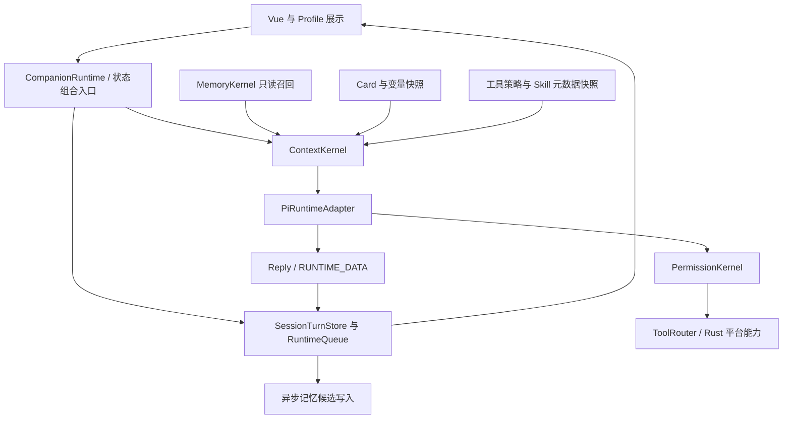

# 轻量陪伴运行时与统一内核建设方案

> 2026-09-17：用户已授权并要求完成整个“记忆系统重构前置准备”分支。阶段 A–D 的运行时、压缩、权限、Skill 与轻量生命周期已实现；集中验证见执行手册 §6.1。阶段 E–F 的 SQLite/长期记忆及质量评测仍待后续建设。
> 本文区分当前事实、建设决策与候选数值。当前能力以源码及 `docs/current/` 为准。
> 本分支会话压缩的协议与原始比较，另见[会话压缩建设方案](../../history/implementation/会话压缩建设方案.md)。

## 1. 产品方向与核心判断

Desk-Pet 首先是可自定义 Card、可搭配 Profile 的陪伴型桌宠。长期使用价值来自人格稳定、对话连续、记得用户、低打扰和低资源占用。助手模式扩展工具与任务能力，但不能使普通聊天承担完整编码代理的启动、上下文和维护成本。

本次建设确立以下方向：

1. **保留现有 Pi 主循环与已落地的会话基础。** 队列先持久化、session/CAS、AgentSlot、未知副作用隔离、RUNTIME_DATA 后处理不重写。
2. **长期记忆抽象继续成立，纯 Markdown 限制撤销。** 推荐 Rust 内嵌 SQLite 作为下一阶段长期记忆的真相源；Markdown 保留为人工指令、Card、会话正文及记忆导入导出形式。
3. **上下文与全局状态分别统一。** ContextKernel 决定本次请求看见什么；领域 Store 决定事实是什么；Pi 内存消息列表和 Vue 展示都不是新的持久化真相源。
4. **权限统一裁决。** `allow / ask / deny` 是最终结果；`passthrough` 是中间结果，表示继续交给下一层规则。MCP 不因协议身份获得默认放行。
5. **Skill 做两种渐进披露。** 模型最初只看元数据；应用也不应在启动时读入并常驻所有正文。
6. **用 Pi 原生生命周期收拢编排。** 输入排队前的规范化仍保留；工具前置门禁、上下文转换、结果处理与观测各有明确接入点，不重建无消费者的通用 HookBus。
7. **会话压缩现在可以独立建设。** 它依赖会话事件和 ContextKernel，不依赖未来 SQLite 记忆存储。长期事实提取与整理随后建设。

不在本轮设计中扩展：Profile 渲染重写、Gateway、多端远程代理、任意脚本插件系统、常驻编码侧车、自动 Dreaming 全套分期。后续确有产品需求时再立项。

## 2. 证据范围与三项目取舍

### 2.1 核对范围

本次根据本地源码、CodeGraph 调用关系和现有运行时契约审查；没有运行参考项目或对摘要质量做同数据集 A/B 测试。因此“更适合”是架构适配判断，不是宣称某项目摘要准确率最高。

| 仓库 | 核对基线 | 限制 |
|---|---|---|
| Desk-Pet | `726dc0e` | 方案制定时的干净基线；后续实现状态见文首与执行手册 |
| OpenClaw | `2634c04a64c` | 仅代表本地 checkout，不代表所有部署配置 |
| Hermes | `91937a6dc` | 仅代表本地 checkout，不代表所有插件/Provider |
| ClaudeCode | 本地 `../ClaudeCode` 可见源码 | 没有 Git 元数据，含 feature 分支及打包痕迹；不能等同于官方全部发布行为 |
| Pi | 项目锁定 `@earendil-works/pi-agent-core` / `pi-ai` 0.85.1 | hook 语义以安装包类型和实现为准；最新文档仅作辅助 |

### 2.2 借鉴什么

| 主题 | ClaudeCode | OpenClaw | Hermes | Desk-Pet 选择 |
|---|---|---|---|---|
| 权限 | 规则来源、工具专属检查、ask 状态机、参数级授权 | deny-first、多层策略交集、MCP 独立过滤 | 平台执行与扩展点隔离 | 一个 PermissionKernel，Rust 保留最终硬约束 |
| 上下文 | 压缩边界、近期尾部、摘要后状态恢复 | 摘要校验、取消保护、近期 token 保留 | 稳定前缀、选择与压缩分离、有效输入窗口 | ContextKernel 统一预算与请求视图 |
| 记忆 | 小入口与按需展开 | 文件分层、SQLite 检索、来源和 taint | 可替换 provider、异步写入 | 窄 RecallPort + 独立写端口 + 本地 SQLite |
| Skill | 目录元数据、调用时加载、listing 预算 | 能力过滤、版本化 session snapshot | 元数据/全文分层，压缩后允许重新读取 | 沿用 read，元数据缓存与正文按需加载 |
| 生命周期 | session 实例、恢复和确认态 | durable outbox、MCP 生命周期 | context engine 与 memory provider 生命周期 | 保留现有事件/CAS，统一代际及只读快照 |
| 轻量性 | 可借预算和延迟加载方法 | 可借按需连接、缓存上限 | 可借窄扩展接口 | 不引入三者完整常驻服务体系 |

参考项目共同做得好的地方是：把决策输入、持久化结果和失败路径写清楚。不能只复制类名、配置数量或摘要 Prompt。

## 3. 方案制定时的事实与差距（实施前基线）

| 当前实现 | 已有价值 | 本阶段缺口 |
|---|---|---|
| `context/kernel.ts` 六层 block | 有顺序、预算和裁剪记录 | 顺序吃满预算；按字符截断 block；消息未统一按完整 round 选择 |
| `context/builder.ts` | 人格、变量、画像、摘要已有集中组装点 | CANDY 与摘要混在 memory block；Skill 清单混在动态块；前缀不够稳定 |
| `engine/pi/model-gateway.ts` | 主回合/一次性请求统一模型、认证、取消和 deadline | 输出预算与 ContextKernel 分别计算，容易偏离 |
| `engine/pi/runtime.ts` | 已接 beforeToolCall、transformContext、payload/response 和 subscribe | transformContext 目前主要采集快照；工具轮之间没有统一预算预检 |
| `engine/compactor.ts` | LLM 结构化摘要和会话版本检查已存在 | 轮末触发、粗略消息数估算、没有持久化覆盖边界；提交结果语义不完整 |
| `persistPiMessage` 与会话事件 | UI 可展示工具调用/结果，事件类型预留 tool/round 字段 | 工具原文尚未经该路径持久化，apiRoundId 未实际赋值；首个压缩 checkpoint 前必须补序号、round 与工具事件 |
| `agent/memory/provider.ts` | 只读可注入 recall、1.5 秒超时、session 与预算 | 默认空实现；提取、索引、纠正、遗忘未形成闭环 |
| `skill/loader.ts` | Prompt 只列 name/description/location | 启动仍逐个读取正文，缓存持有 content |
| `safety/checker.ts` | 动态风险、deny-first、精确参数信任 | 风险、模式和最终行为耦合；grant 缺少显式作用域/期限/代际 |
| `init.ts` | 统一初始化、部分助手工具动态加载 | mcpEnabled 可直接触发全部连接；Skill 全文始终加载；启动整理定时器 |
| session/queue/AgentSlot | queued 先写盘、CAS、隔离未知副作用 | 生命周期分散，UI 相位/事实/运行租约容易被混用 |

注意：Bash 输出 spill 已有 Rust 实现和执行环境接线，不能写成“完全没有 spill”。缺少的是它与 ContextKernel 的压缩引用、可恢复生命周期及完整 round 选择的统一契约。

## 4. 运行时与状态统一

### 4.1 资源分三档

| 档位 | 何时启动 | 常驻内容 | 禁止隐式启动 |
|---|---|---|---|
| Presence | 应用启动 | Profile 展示、窗口/快捷键、Card 选择与最小会话索引 | MCP、Planner、子代理、记忆 LLM 整理 |
| Conversation | 首次聊天或允许的主动互动 | CardRuntime、ContextKernel、Pi Provider、近期 transcript、小型本地 recall | 编码侧车、全库向量化、全 Skill 正文加载 |
| Assistant | 用户进入助手模式且任务需要 | 按需工具、MCP、Planner、深度检索、子代理 | 无任务时常驻全部服务器/进程 |

轻量模式不能因为“要轻量”失去基础记忆。稳定用户画像与小预算本地召回可以进入 Conversation；远程多轮检索、全库重建和 LLM 整理不进入首答关键路径。

退出助手模式时关闭其进程、连接、定时器和大缓存。动态 import 不等于模块可卸载，也不保证 WebView 内存立即归还操作系统；指标必须实际测量。

### 4.2 五层状态

| 层 | 所有权 | 生命周期 | 恢复来源 |
|---|---|---|---|
| Durable | SessionTurnStore、配置存储、未来 MemoryStore | 跨重启 | 原子提交的文件/数据库 |
| Application | 模式、Profile/Card 选择、平台能力 | 应用 | 配置 + 明确激活命令 |
| Session | 会话队列、transcript revision、context epoch、确认请求 | 会话 | 事件日志和有效压缩记录 |
| Run | generation、request/turn、abort、预算、工具次数 | 一次运行 | 不复活旧租约；由持久化状态决定重建/隔离 |
| Projection | Vue 消息列表、忙碌标志、进度、表达效果 | 窗口 | 前四层只读投影 |

`RuntimeStateKernel` 是组合入口：命令分派、只读 `snapshot()`、typed `subscribe()`；各领域仍由自己的 Store 单写。不能把所有状态搬进一个任意模块都能改的大对象。

统一身份包括 `sessionId / requestId / turnId / runGeneration`；压缩补充 `contextEpoch / transcriptRevision`。`sessionId` 表示用户会话，不能因压缩改变；`contextEpoch` 表示请求视图发生了合法替换。

配置、Card、模式、工具集形成 run 级冻结快照。用户在运行中改变设置时，选择“下一回合生效”或“取消当前回合再生效”；不得同一工具轮前后使用不同权限规则却共享旧确认。

### 4.3 领域职责



以上是职责图，不要求创建同名目录或额外包装每个现有模块。先收敛现有 barrel 和调用入口；只有职责真正独立且有多个文件时再拆目录。

## 5. ContextKernel：统一预算、稳定前缀和请求视图

### 5.1 先算总账，再分层

`W` 是设置中的上下文窗口，并受已知 Provider 能力上限校验。`O` 是网关本次真实请求的输出上限，包含该 Provider 计入输出预算的 reasoning；它与 ContextKernel 共享同一预算快照，不能各算一套。

```text
hardInputLimit = W - O - protocolOverhead
compactionHeadroom = min(20_000, floor(W * headroomRatio))
normalInputTarget = hardInputLimit - compactionHeadroom
```

`headroomRatio=16%` 只作为第一轮候选值。`protocolOverhead` 需覆盖序列化/角色/多模态等估算误差；工具 schema 属于输入预算，不能遗漏或与 overhead 重复扣减。没有可信 tokenizer 时保守估算，并用真实 usage 校准。

超过 normal target 触发清理或压缩；hard limit 是发送前必须满足的上限。不要为了保持固定空白，默默截掉用户输入。若不可裁剪内容已超过 hard limit，应给出可解释的上下文不足结果。

**20K 有三种不同含义，不能复用一个配置字段：**

- 压缩触发前保留的余量 `compactionHeadroom`。
- 压缩后保留原文尾部的目标 `keepRecentTokens`。
- 摘要正文自身的上限 `summaryMaxTokens`。

本方案把用户提出的 20K 优先解释为大窗口的压缩余量上限；摘要正文应更小。OpenClaw 的默认 20K 近期尾部是另一个参数。16K 窗口不能硬留 20K，所有候选值必须经过小窗口校验。

### 5.2 百分比分配

下表为 normal input target 的初始配比，用于评测起点，不是已生效配置：

| 内容 | 比例 | 超额策略 |
|---|---:|---|
| 应用协议、人工指令与 Card 固定部分 | 12% | 核心协议不可截断；过大的 Card 在激活/保存时提示预算问题 |
| 工具 schema、Skill 元数据 | 8% | 按模式/任务选择集合；Skill 降为短描述/名称；不得截坏 schema |
| 用户画像、Card 变量、运行状态 | 10% | 只取相关字段，优先级裁剪整个条目 |
| 长期召回 | 15% | 去重、来源过滤、相关性排序，按完整条目保留 |
| 会话摘要与近期原文 | 50% | 摘要通常只占此池的小部分；完整 round 保留尾部 |
| 当前输入与临时上下文 | 5% | 当前用户输入具有保障，可借其他池余额；临时块先淘汰 |

总和 100%；份额是软预算，不是必须填满的占位。剩余预算优先借给当前用户输入、近期对话，再借给相关记忆。工具少的轻量模式自然获得更多对话空间。自动调整必须在快照中记录 `requested / assigned / used / borrowed / dropped`。

### 5.3 稳定前缀

把语义层与传输位置分开。现有六层 block 可保留兼容适配，但输出增加三个段：

1. `staticPrefix`：应用协议和安全边界、当前 Card 固定文本、稳定人工指令。
2. `sessionStatic`：本会话冻结的工具集合、Skill 元数据和必要配置。Provider 将工具放在独立字段时，仍记录其稳定 hash，不能声称所有 Provider 的工具都在 system 前缀里。
3. `turnDynamic`：变量、召回、压缩摘要引用、当前环境和临时来源块。通过明确来源的上下文块映射为 Provider 支持的格式，不伪装成真实用户指令。

Card 或 CANDY 修改后允许前缀失效，但记录 `prefixHash / breakReason / configGeneration`。不要为缓存而冻结用户明确要求生效的设置。缓存收益依赖 Provider，不能只凭字节稳定就声称节省了计费 token。

当前 `CANDY + sessionSummary` 合并需要拆开：前者是人工指令，后者是派生历史数据。摘要、工具输出和外部记忆不得继承 CANDY 的指令权限。

### 5.4 选择、压缩、持久化各司其职

- Selection：本次请求选哪些完整块和 round，不改原始 transcript。
- Compaction：生成并提交可恢复摘要和覆盖边界，改变后续请求视图。
- Persistence：完整会话继续保留；UI 展示完整历史，不因 provider 视图缩短而“丢消息”。

逐步加入图片/大文件引用的 token 估算，不能只用字符数衡量多模态内容。首阶段仍以现有文字与工具链路为验收范围，超大非文本输入显式限流。

## 6. PermissionKernel：风险、策略与确认分离

### 6.1 类型与顺序

```ts
type PermissionDecision = "allow" | "ask" | "deny"
type ToolCheckResult = PermissionDecision | "passthrough"
type EffectClass = "read" | "local_mutation" | "process" | "external_side_effect"
```

保留现有风险等级作为输入，不把 SAFE/NORMAL/DANGER/NOWAY 简单改名为以上四个结果。风险描述本次操作可能造成什么；权限描述当前用户规则是否允许。

统一决策顺序：不可放宽的硬拒绝 → 标准化参数与资源校验 → 模式/来源范围 → 显式 deny/ask 规则 → 工具专属检查 → 显式 allow/有效 grant → 默认 ask 或 deny。独立约束取交集，deny 优先，安全要求的 ask 不能被普通 allow 吞掉。

Rust 在实际平台操作前重新校验其能验证的路径、参数和硬策略；TS 负责用户交互和策略组合。MCP 远端服务器内部行为不受本地 Rust 沙箱完整控制，不能给用户相反印象。

### 6.2 MCP passthrough

MCP 适配器可返回 passthrough，随后由 server/tool 规则与全局策略收敛。未配置的新服务器默认 ask 或 deny；用户可为已信任的确定工具设定 allow。发现工具不等于信任工具。

需要支持服务器启停、include/exclude 工具过滤、连接/请求超时、catalog 版本、失败冷却及 session 归属。工具说明和返回内容都带外部来源与 taint，不能改写权限规则。

### 6.3 确认状态

确认请求保存 `requestId、sessionId、runGeneration、toolCallId、inputHash、policyHash、expiresAt`，只能 settle 一次。显示具体影响资源和参数摘要，提供一次允许、有限会话授权、拒绝。授权作用域不得因为工具名相同而扩大。

同意前重验输入和策略；变更后重新评估。恢复时未决确认标 stale/cancelled，不能自动执行。关闭窗口或超时按明确拒绝处理。Card 只能改变温和的呈现文案，不能隐藏风险或改变结果。

权限规则必须通过统一设置入口管理；不要同时在 Card、Skill、MCP 配置和工具函数里保留互相覆盖的 allow 开关。

## 7. Skill：模型和应用都渐进加载

第一层索引只持有 `name / description / location / capabilityTags / invocationPolicy / mtime / size / fingerprint`。只解析有界 frontmatter；保存或刷新时校验，避免每次对话扫描磁盘。

第二层在模型确定任务相关后通过已有 read 读取正文。需要时再读取正文引用的资源，不把整个技能目录注入。超长正文要明确报预算不足或要求拆分，不能悄悄只读一半却标记“已加载”。

清单有 token 上限，并按模式/能力过滤。Skill 可在轻量模式提供聊天玩法，但不能因此获得 bash、写文件或 MCP 权限；`allowed-tools` 若支持，只是所需能力声明。

session 保存 catalog fingerprint；保存、删除、切模式时使快照失效。压缩后丢失的已加载正文允许重新 read，不能被永久 read-dedup 阻止。只在摘要中保留相关技能名、版本和重新读取位置。

Skill 正文属于执行说明，不能作为用户原话写入长期记忆。原始用户请求与展开内容必须分开，记忆候选只从有资格的来源提取。

## 8. Pi Hooks：复用原生扩展点

下表同时列出宿主调用步骤和 Pi 原生回调，二者不能混淆：ingress 与初次 preflight 是 Desk-Pet Adapter 的普通调用；Pi 0.85.1 没有“initial prepare” hook。其 prepareNextTurnWithContext 只用于首个 turn 之后的继续循环。

| 接入点 | 职责 | 失败策略 |
|---|---|---|
| ingress preprocessor | 空输入、规范化、slash、身份与幂等信息；先于入队 | 输入错误返回明确结果，不进入 Pi |
| 宿主 preflight（非 Pi hook） | 调用 Agent 前读取冻结状态、预算预检、必要压缩提交 | 无安全可发送视图时停止本次请求 |
| transformContext | 应用已提交视图、每次请求选择、合法性/预算检查和快照 | 遵守 Pi 0.85.1 不抛异常契约；返回安全视图；无法满足时由 Adapter/发送前门禁停止请求 |
| beforeToolCall | 配额与 PermissionKernel，等待有身份的确认 | fail-closed，不执行工具 |
| afterToolCall | 结果脱敏、长度限制、引用、taint、审计 | 不能将已发生的副作用改为未发生；返回结构化失败/安全结果 |
| prepareNextTurnWithContext | 工具轮结束后的受控上下文替换和代际检查 | 只消费已提交状态，不成为第二个持久化 Store |
| shouldStopAfterTurn | 配额/取消/无法继续的终止条件 | 不伪造成功；其执行先于 steer/follow-up，队列必须留待后续处理 |
| subscribe | trace、展示与持久化任务收集 | 观察者异常隔离；必须落盘的任务在 settle 前显式 await |
| onPayload/onResponse | 最终 payload hash、HTTP 观测 | 遥测失败不能改变执行结果 |
| message/turn 完成事件 | settled usage、cache 信息、回合持久化 | usage 缺失时标未知，不把 HTTP headers 当 token usage |

不要把所有前处理都搬到 transformContext：它位于输入入队之后，不能替代 slash、幂等、原文保存。不要从外部参考项目复制另一套 hook 命名与调度器包在 Pi 外面。

首阶段只使用 Pi 已公开的扩展点和普通领域函数。需要 `compaction_committed` 等领域事件时使用现有 typed event/trace 模式，不引入任意 shell 回调。

## 9. MemoryKernel：本地结构化记忆

### 9.1 存储划分

| 数据 | 建议真相源 | 说明 |
|---|---|---|
| Card、CANDY | 用户可编辑文件 | Card 不拥有用户长期事实；CANDY 是人工指令 |
| Card/interaction 状态 | 现有人格持久化 | 继续 VariableState 校验，不并入用户记忆 |
| 完整会话与压缩提交 | `sessions/*.md` 的事件协议 | 本阶段保留，压缩改变请求视图而非删除正文 |
| 长期用户事实、偏好、关系与情节 | Rust 管理的 SQLite | 事务、版本、来源、过期、纠正、可查询 |
| MEMORY/User 文件视图 | 导出或只读投影 | 迁移后不能双向自动同步成两个真相源；人工修改通过显式导入 |
| 向量索引 | 后续可重建的可选派生索引 | 不作为默认依赖，不承载唯一事实 |

SQLite 推荐理由是本地单文件、无额外服务、事务更新与索引查询；不保证任何平台上 RSS/包体必然更小，需要与当前 Markdown 全量扫描和内存索引作基准对比。数据根、初始化、备份、schema migration 统一由 Rust 路径/存储模块管理。

### 9.2 保持小接口

现有 `MemoryProvider.recall()` 继续作为 Runtime 唯一读端口。写入、纠正、遗忘放在独立写端口，由回合提交后任务调用；不一次塞入工具注册、备份、子代理和插件所有职责。

最小表：`memory_item` 保存内容、kind/scope/status、重要性/置信度、观测及有效时间、过期、替代关系、version；`memory_source` 保存会话/事件来源、origin/taint、hash；全文索引可重建。关系边和向量表在评测证明需要后增加。

查询先做用户/Profile/Card/session scope 和状态过滤，再全文检索与排序，最后去重及 token 裁剪。中文必须有明确分词或 n-gram 策略及短查询测试；不能把“用了 FTS5”直接等同于中文召回有效。分词规则与版本持久化，变更后重建索引。

### 9.3 写入与遗忘

```text
用户/助手回合持久化成功
  -> eligible source 过滤
  -> 有界候选队列（eventId 幂等）
  -> 规则去重/来源校验/敏感与冲突检测
  -> 必要时低预算模型提取
  -> 事务提交或待确认候选
  -> recall 索引失效与重建
```

轻量模式先支持用户明确的“记住/纠正/忘记”，再评测普通对话自动候选。明确陈述和模型推测分开存储；推测不能自动变成事实。

纠正用 supersedes/有效区间消除相互矛盾的 active 条目。遗忘要从事实、索引、缓存和自动回灌来源一起处理，并解释会话原文与备份的独立删除范围。删除一条记忆后不能下轮又从旧会话自动提取回来。

压缩摘要只是一种候选来源，不自动等于长期事实。历史安全拒绝、Skill 指令、工具输出和主动搭话不得因进入摘要而洗掉 taint。

### 9.4 陪伴产品的记忆质量

优先覆盖称呼、表达偏好、持续话题、用户明确期待、共同经历；避免每句闲聊都永久留存。区分稳定偏好、短期情绪和有时效的事项。过去的一次负面情绪不能成为永久人格判断。

不同 Card 共享哪些用户事实由 scope 决定；同一用户的基础偏好可共享，角色关系进展和 Card 状态默认隔离。用户需能查看“记住了什么、来自哪里、何时更正”，直接编辑/忘记。

迁移采用只读盘点 → 预览 → 备份 → staging DB 导入 → 数量/来源/hash 校验 → 单一开关切换。失败回到旧 reader；没有双写兼容期的隐式同步。本文落盘不迁移真实数据。

## 10. 陪伴体验与资源策略

人格固定文本与动态变量分开；表达效果在 ReplyGenerator 完整校验 RUNTIME_DATA 后应用。摘要采用陪伴/助手两个内容模板，共用压缩协议，不能让“关键技术/文件路径”成为陪伴对话摘要的必填中心。

主动搭话继续小预算、无工具、来源明确、冷却控制；低打扰优先于触发频率。后台工作采用有界队列，在前台对话开始时暂停或降低优先级，避免整理抢占首答。

MCP 以能力需求连接，按 session/模式释放；长期记忆检索设置本地超时与空召回降级。缓存按条数/字节/TTL 设置上限，不仅依赖“会话结束就清理”。

记录 Presence/Conversation/Assistant 三档的冷启动、空闲 RSS、窗口 CPU、首 token 延迟、每轮输入/输出 token、工具 schema/Skill token、压缩耗时与失败率。没有实测前不承诺固定 MB/ms；先要求轻量模式无无关子进程、无后台 LLM 请求。

## 11. 实施顺序

### 11.1 可先行的压缩工作包

P4 存量缺口已在本分支收口：摘要结果语义、固定 session、稳定事件顺序、实际 round 身份、工具原文、可验证覆盖边界与请求前预算均已接线。该工作包没有等待 SQLite 或 MemoryKernel；实现与集中验证状态见[执行手册](记忆系统重构执行手册.md)。

### 11.2 总体阶段

| 阶段 | 交付 | 依赖与退出条件 |
|---|---|---|
| A 基线与压缩先行 | 资源基线、压缩提交协议、边界记录、完整 round 与预检 | 当前 SessionTurnStore/CAS；不新增长期记忆后端 |
| B 轻量运行档位与状态 | 组合入口、领域所有权、冻结快照、移除无关启动工作 | 切 session/Card/模式的在飞回合不串写 |
| C ContextKernel 完整建设 | 前缀稳定、比例预算、真实 usage、工具轮预检 | 16K/32K/128K、长工具输出及失败降级场景 |
| D 权限与 Skill | 三种最终结果、passthrough 收敛、确认生命周期、元数据快照 | deny-first、参数改动重审、旧确认失效、正文按需读 |
| E 本地长期记忆 | SQLite adapter、导入导出、明确记忆指令、候选门禁和 recall | 修正/遗忘/过期/来源隔离与中文检索 eval |
| F 助手增量 | 深度检索、可选向量、按需 Planner/子代理、后台整理 | 前述门禁通过且性能指标不回退 |

阶段不是另起 P0–P6 的实现进度。A–D 对应的前置已实现，E–F 仍未开始；实际门禁结果以执行手册当前检查点为准。

## 12. 验收与文档同步

| 范围 | 必须验证 |
|---|---|
| 轻量启动 | 不连接 MCP、不常驻 Skill 正文、不启动 LLM 整理；允许必要的首次资源种子复制 |
| Context | 总预算含 schema；当前输入/核心协议不静默截断；tool pair 完整；选取结果不改会话正文 |
| 压缩 | 只有 committed 才报告完成；边界与摘要同一原子提交；CAS/取消失败保留旧视图；重启恢复一致 |
| 状态 | 切 session、Card、模式、取消、旧 generation 回调均不会改写新运行 |
| 权限 | executor 收不到 passthrough；deny 优先；确认参数/策略变化后失效；恢复不重放副作用 |
| Skill | 初始 Prompt 无全文；索引缓存失效可追踪；压缩后能重新读取；内容不污染用户记忆 |
| Memory | 中文/短查询、无相关记忆、矛盾纠正、过期、删除防回灌、来源与 scope 隔离 |
| 跨平台 | macOS 本地验证；涉及 Windows 条件代码/依赖时看 Windows CI，不把交叉 check 作为通过 |

代码变更时按 live/SKILL.md 重新 analyze → generate，并更新受影响 Contract 的 sourceHash。真实入口用 `sendMessage()` 场景；并发/CAS/取消使用可重复 fake provider 驱动真实 Pi/IPC。类型检查不能替代运行验证。

新配置先确定语义，再同步默认/开发模板、Config/getter、设置页映射和文档；本分支没有修改用户真实开发配置或运行时数据。

## 13. 参考索引

以下相对链接面向同级 `/someworks` 本地 checkout；不将参考项目代码复制为 Desk-Pet 依赖。

- Desk-Pet：[ContextKernel](../../../src/services/context/kernel.ts)、[builder](../../../src/services/context/builder.ts)、[Pi runtime](../../../src/services/engine/pi/runtime.ts)、[compactor](../../../src/services/engine/compactor.ts)、[MemoryProvider](../../../src/services/agent/memory/provider.ts)、[初始化](../../../src/services/init.ts)、[Skill loader](../../../src/services/skill/loader.ts)。
- ClaudeCode：[权限类型](../../../../ClaudeCode/src/types/permissions.ts)、[权限决策](../../../../ClaudeCode/src/utils/permissions/permissions.ts)、[确认处理](../../../../ClaudeCode/src/hooks/toolPermission/handlers/interactiveHandler.ts)、[Skill listing](../../../../ClaudeCode/src/tools/SkillTool/prompt.ts)、[压缩实现](../../../../ClaudeCode/src/services/compact/compact.ts)。
- OpenClaw：[记忆](../../../../openclaw/docs/concepts/memory.md)、[压缩](../../../../openclaw/docs/concepts/compaction.md)、[工具策略](../../../../openclaw/src/agents/tool-policy-match.ts)、[Skill](../../../../openclaw/docs/tools/skills.md)、[MCP 配置](../../../../openclaw/docs/gateway/config-extensions.md)。
- Hermes：[ContextEngine](../../../../hermes-agent/agent/context_engine.py)、[ContextCompressor](../../../../hermes-agent/agent/context_compressor.py)、[MemoryProvider](../../../../hermes-agent/agent/memory_provider.py)、[Skill](../../../../hermes-agent/tools/skills_tool.py)。
- Pi：[官方 Agent 文档](https://github.com/earendil-works/pi/blob/main/packages/agent/README.md)；Context7 已用于辅助核对，但本项目行为仍以锁定版本的 `agent.d.ts`、`types.d.ts`、`agent-loop.js` 为准，Agent Core 与完整 AgentHarness 不混用。
